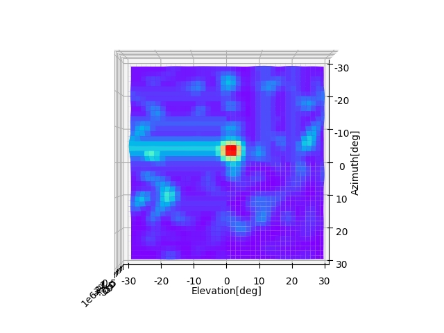
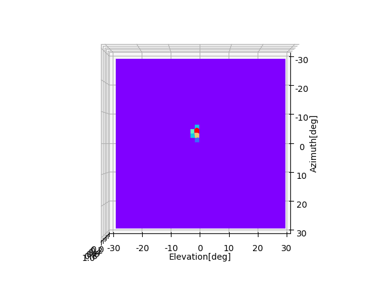
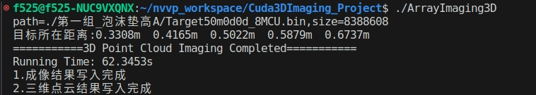

# GPU_ArrayRadarImaging
利用CUDA加速阵列雷达3D成像过程，与传统方法对比。目前工程包含2个版本:对单个距离切片的2维BP成像和空间3维BP成像，通过python绘制成像结果。

读取相关参数包括:1)雷达回波数据;2)MIMO天线阵元位置Tx,Rx;3)误差校准权重。

雷达采集1帧数据为：8路并行，512 点, 32 Chirp, 每一路32个收发通道

# 开发环境
Linux Ubuntu 18.04, CUDA 12.0

# 编译运行

nvcc -o ArrayImaging ArrayImaging.cu --ptxas-options=-v --use_fast_math -lcublas -lcufft

./ArrayImaging

# 成像结果
## 1.单个距离切片的二维成像

流程：误差校准 + range_fft + 2DBP + 2D_CFAR

测试目标角反位于50cm，方位俯仰角大约0°处，成像角度范围为-30°~30°。点目标成像结果:

通过CUDA对当前距离切片做2维CA-CFAR后得到目标位置:

耗时：11.1002s (-30,30)

## 2.三维点云成像

流程：误差校准 + range_fft + 1D_CFAR(这里直接取目标位置附近做切片) + 2DBP + 2D_CFAR

进一步对距离维进行网格划分,3维成像的执行结果

