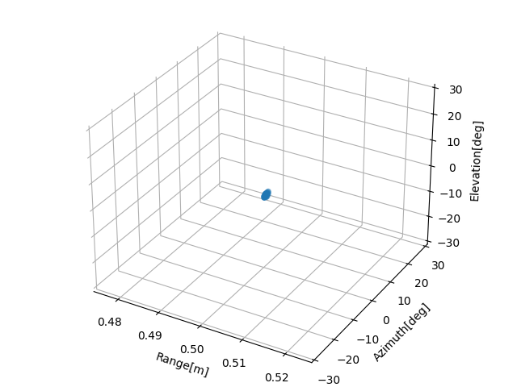

# GPU_ArrayRadarImaging
利用CUDA加速阵列雷达3D成像过程，与传统方法对比。目前工程包含2个版本:对单个距离切片的2维BP成像和空间3维BP成像，通过python绘制成像结果。

读取相关参数包括:1)雷达回波数据;2)MIMO天线阵元位置Tx,Rx;3)误差校准权重。

雷达采集1帧数据为：8路并行，512 点, 32 Chirp, 每一路32个收发通道

# 版本说明
_cpu：直接通过CPU计算成像(CFAR采用CUDA库函数实现)

_gpu：划分Na个Grid,每个Grid包含Naz_net*Nay_net的二维block,用于计算A_Comp补偿因子以及亮温反演

# 开发环境
Linux Ubuntu 18.04, CUDA 12.0

# CUDA优化方法
1)循环展开：手动展开内层循环以减少循环控制的开销。

2)向量化操作：尽量使用更多的线程来并行处理数据。

# 成像结果
## 1.单个距离切片的二维成像

流程：误差校准 + range_fft + 2DBP + 2D_CFAR

测试目标角反位于50cm，方位俯仰角大约0°处，成像角度范围为-30°~30°。点目标成像结果:

通过CUDA对当前距离切片做2维CA-CFAR后得到目标位置:

cpu版本耗时：11.1002s (-30,30)

gpu版本耗时：1.5252s (-30,30)  加速比：727.7%

## 2.三维点云成像

流程：误差校准 + range_fft + 1D_CFAR(这里直接取目标位置附近做切片) + 2DBP + 2D_CFAR

进一步对距离维进行网格划分,3维成像的执行结果

点云成像结果

